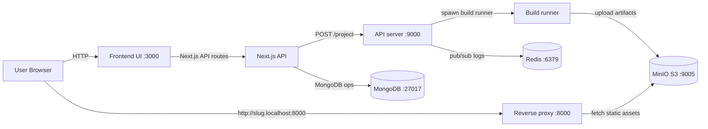
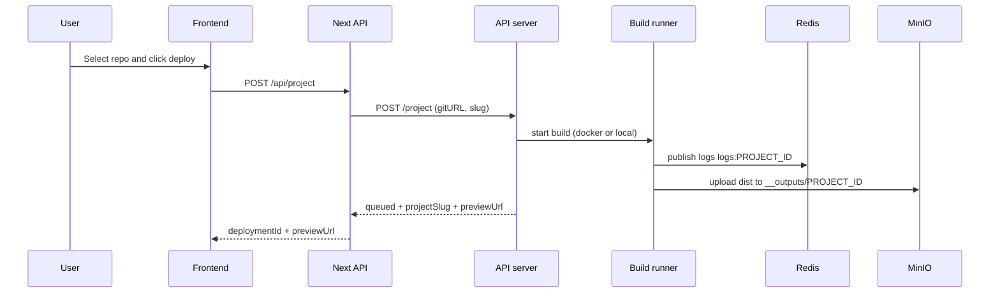
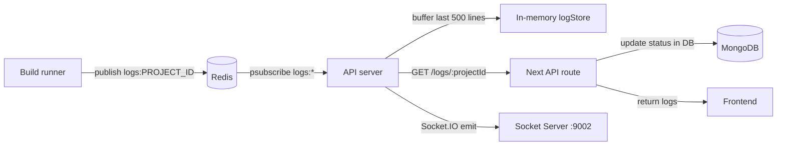
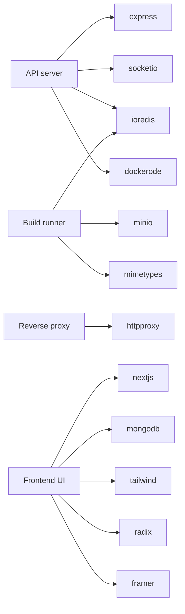

# Project Report - DeployKit (Vercel Clone)

## 0. Scope and Sources
This report is based on a full read of the core runtime, build, and UI code, plus docker and configuration files.

Key sources (primary):
- [README.md](README.md)
- [docker-compose.yml](docker-compose.yml)
- [Dockerfile.all-in-one](Dockerfile.all-in-one)
- [api-server/index.js](api-server/index.js)
- [api-server/config.js](api-server/config.js)
- [build-server/script.js](build-server/script.js)
- [build-server/main.sh](build-server/main.sh)
- [build-server/config.js](build-server/config.js)
- [s3-reverse-proxy/index.js](s3-reverse-proxy/index.js)
- [frontend-nextjs/app](frontend-nextjs/app)
- [frontend-nextjs/lib/mongodb.ts](frontend-nextjs/lib/mongodb.ts)
- [frontend-nextjs/lib/deployments.ts](frontend-nextjs/lib/deployments.ts)
- [frontend-nextjs/app/api](frontend-nextjs/app/api)
- [frontend-nextjs/app/globals.css](frontend-nextjs/app/globals.css)
- [frontend-nextjs/tailwind.config.ts](frontend-nextjs/tailwind.config.ts)
- [.env](.env)

Note: Some UI pages use mock data. Those are explicitly called out in this report.

## 1. Executive Summary
DeployKit is a self-hosted Vercel-like deployment platform that accepts a GitHub repository URL, builds the project in an isolated runner, stores static artifacts in S3 (MinIO locally), and serves them via a reverse proxy on a per-project subdomain. A Next.js frontend provides OAuth login, repository browsing, deployment creation, and deployment views. MongoDB stores deployment metadata. Redis is used for log streaming (pub/sub) and the API server caches recent logs in memory for polling or socket delivery.

## 2. High-Level Architecture
The system is split into five runtime services plus supporting infra (MongoDB, Redis, MinIO). There are two run modes: local docker-compose (multiple containers) and a single-image all-in-one mode that uses supervisord to run all services inside one container.



## 3. Service Inventory and Responsibilities

### 3.1 API Server
Folder: [api-server](api-server)

Key responsibilities:
- Accept deployment requests and generate a unique `projectSlug`.
- Start a build runner either as a Docker container or local process.
- Subscribe to Redis log channels and buffer the most recent logs in memory.
- Provide log polling endpoint for the frontend.
- Emit logs to clients via Socket.IO.

Core logic:
- `POST /project`: accepts `gitURL` and optional `slug`, generates slug using `random-word-slugs`, and starts build. Response returns preview URL of the form `http://<slug>.localhost:8000`.
- `GET /logs/:projectId`: returns buffered logs with cursor-based paging.
- Log streaming via Redis `psubscribe logs:*` and Socket.IO on port 9002.

Primary file: [api-server/index.js](api-server/index.js)
Config loader: [api-server/config.js](api-server/config.js)

Key libraries:
- `express` for HTTP routing.
- `socket.io` for optional live log streaming.
- `ioredis` for pub/sub.
- `dockerode` to start build containers when `BUILD_RUNNER_MODE=docker`.
- `random-word-slugs` for readable project slugs.

Build runner modes:
- Docker mode (default in compose): API starts a container from the build runner image (from [build-server/Dockerfile](build-server/Dockerfile)) and passes env vars.
- Local mode (all-in-one): API spawns the build server locally using `bash main.sh`.

### 3.2 Build Runner Service
Folder: [build-server](build-server)

Key responsibilities:
- Clone the target Git repo and run the build.
- Publish log output to Redis as `logs:<PROJECT_ID>`.
- Upload static build output to MinIO under `__outputs/<PROJECT_ID>/...`.

Core flow:
- [build-server/main.sh](build-server/main.sh) clones `GIT_REPOSITORY__URL` into `OUTPUT_DIR` and runs [build-server/script.js](build-server/script.js).
- [build-server/script.js](build-server/script.js) runs `npm install` and `npm run build`, expects a `dist` directory, and uploads files to MinIO.

Important constraints:
- Build output must be in `dist`. Repos that produce `.next`, `build`, or other output will fail unless adapted.
- Build command is fixed to `npm install && npm run build`.

Key libraries:
- `minio` for S3-compatible storage.
- `ioredis` for log publish.
- `mime-types` to set object content-type metadata.

### 3.3 Reverse Proxy Service
Folder: [s3-reverse-proxy](s3-reverse-proxy)

Key responsibilities:
- Map incoming subdomain to the MinIO object path.
- Serve `index.html` at the root path.

Behavior:
- Extracts `subdomain` from `req.hostname` and proxies to `OUTPUTS_BASE_URL/<subdomain>`.
- If the request path is `/`, the proxy appends `index.html`.

Primary file: [s3-reverse-proxy/index.js](s3-reverse-proxy/index.js)

### 3.4 Frontend + API
Folder: [frontend-nextjs](frontend-nextjs)

Key responsibilities:
- User interface for login, repo selection, deployment creation, and deployment views.
- GitHub OAuth integration.
- API routes that proxy to the API server and persist metadata in MongoDB.

Architecture:
- Next.js App Router under [frontend-nextjs/app](frontend-nextjs/app).
- Serverless-style API routes under [frontend-nextjs/app/api](frontend-nextjs/app/api).
- UI components under [frontend-nextjs/components](frontend-nextjs/components).

Important UI pages:
- Landing page: [frontend-nextjs/app/page.tsx](frontend-nextjs/app/page.tsx)
- Login: [frontend-nextjs/app/login/page.tsx](frontend-nextjs/app/login/page.tsx)
- Dashboard: [frontend-nextjs/app/(app)/dashboard/page.tsx](frontend-nextjs/app/(app)/dashboard/page.tsx)
- New project: [frontend-nextjs/app/(app)/projects/new/page.tsx](frontend-nextjs/app/(app)/projects/new/page.tsx)
- Deployment detail: [frontend-nextjs/app/(app)/projects/[id]/page.tsx](frontend-nextjs/app/(app)/projects/[id]/page.tsx)

API routes:
- OAuth config: [frontend-nextjs/app/api/auth/config/route.ts](frontend-nextjs/app/api/auth/config/route.ts)
- OAuth start: [frontend-nextjs/app/api/auth/github/route.ts](frontend-nextjs/app/api/auth/github/route.ts)
- OAuth callback: [frontend-nextjs/app/api/auth/github/callback/route.ts](frontend-nextjs/app/api/auth/github/callback/route.ts)
- Auth status: [frontend-nextjs/app/api/auth/status/route.ts](frontend-nextjs/app/api/auth/status/route.ts)
- Logout: [frontend-nextjs/app/api/auth/logout/route.ts](frontend-nextjs/app/api/auth/logout/route.ts)
- Deployments list: [frontend-nextjs/app/api/deployments/route.ts](frontend-nextjs/app/api/deployments/route.ts)
- Deployment detail: [frontend-nextjs/app/api/deployments/[id]/route.ts](frontend-nextjs/app/api/deployments/[id]/route.ts)
- Project create: [frontend-nextjs/app/api/project/route.ts](frontend-nextjs/app/api/project/route.ts)
- Logs fetch + DB update: [frontend-nextjs/app/api/logs/[projectId]/route.ts](frontend-nextjs/app/api/logs/[projectId]/route.ts)
- GitHub user: [frontend-nextjs/app/api/github/user/route.ts](frontend-nextjs/app/api/github/user/route.ts)
- GitHub repos: [frontend-nextjs/app/api/github/repos/route.ts](frontend-nextjs/app/api/github/repos/route.ts)

UI tabs are defined in [frontend-nextjs/app/(app)/projects/[id]/layout.tsx](frontend-nextjs/app/(app)/projects/[id]/layout.tsx).

Mock data pages (demo only, not wired to backend):
- Analytics: [frontend-nextjs/app/(app)/projects/[id]/analytics/page.tsx](frontend-nextjs/app/(app)/projects/[id]/analytics/page.tsx)
- Runtime logs: [frontend-nextjs/app/(app)/projects/[id]/logs/page.tsx](frontend-nextjs/app/(app)/projects/[id]/logs/page.tsx)
- Environment variables: [frontend-nextjs/app/(app)/projects/[id]/env/page.tsx](frontend-nextjs/app/(app)/projects/[id]/env/page.tsx)
- Deployment history (mocked list): [frontend-nextjs/app/(app)/projects/[id]/deployments/page.tsx](frontend-nextjs/app/(app)/projects/[id]/deployments/page.tsx)

### 3.5 Infrastructure Services
- Redis for pub/sub logs. Managed via [docker-compose.yml](docker-compose.yml) or all-in-one supervisor in [single-image/supervisord.conf](single-image/supervisord.conf).
- MongoDB for deployment metadata. Config in [frontend-nextjs/lib/mongodb.ts](frontend-nextjs/lib/mongodb.ts).
- MinIO for S3-compatible object storage for build artifacts.

## 4. Deployment Flow (End-to-End)
The primary deployment flow is:
1) User selects a repo and clicks deploy.
2) Next.js API route calls the API server and starts the build runner.
3) Build server clones, builds, and uploads static artifacts to MinIO.
4) Reverse proxy serves static assets per project slug via subdomain.
5) Logs are published to Redis and consumed by API server. UI polls logs and updates deployment status in MongoDB.



## 5. Log and Status Flow
Logs move through Redis, get cached by the API server, and are used to derive deployment status in the frontend API route.



Status derivation is defined in [frontend-nextjs/lib/deployments.ts](frontend-nextjs/lib/deployments.ts) by parsing log lines:
- `Build Started...` -> `building`
- `Build Complete` or `uploading` -> `uploading`
- `Done` -> `ready`
- `error:` -> `failed`

## 6. Data Storage Design

### 6.1 Object Storage Layout (MinIO)
Artifacts are uploaded to MinIO under:
- `__outputs/<PROJECT_ID>/<file>`

The reverse proxy maps `http://<slug>.localhost:8000/` to:
- `OUTPUTS_BASE_URL/<slug>/index.html`

Source: [build-server/script.js](build-server/script.js), [s3-reverse-proxy/index.js](s3-reverse-proxy/index.js)

### 6.2 MongoDB Schema (deployments collection)
MongoDB is used to store deployment metadata. Schema is implied by inserts in [frontend-nextjs/app/api/project/route.ts](frontend-nextjs/app/api/project/route.ts) and updates in [frontend-nextjs/app/api/logs/[projectId]/route.ts](frontend-nextjs/app/api/logs/[projectId]/route.ts).

Sample document (logical view):
```
{
  _id: ObjectId,
  ownerLogin: string,
  repoUrl: string,
  repoFullName: string | null,
  projectSlug: string,
  previewUrl: string,
  status: "queued" | "building" | "uploading" | "ready" | "failed",
  latestLog: string,
  createdAt: Date,
  updatedAt: Date
}
```

Notes:
- There are no explicit indexes or schema enforcement in code.
- Status updates happen on log polling requests (not via build server direct write).

### 6.3 Redis Usage
Redis is used for log streaming only:
- Build server publishes to `logs:<PROJECT_ID>`.
- API server subscribes to `logs:*` and buffers in memory.

Sources: [build-server/script.js](build-server/script.js), [api-server/index.js](api-server/index.js)

### 6.4 API Log Cache
The API server keeps the last 500 log lines in memory. This means logs are not durable across API restarts. Source: [api-server/index.js](api-server/index.js)

## 7. API Surface Summary

### 7.1 API Server
- `POST /project` - Start build, return slug and preview URL. Source: [api-server/index.js](api-server/index.js)
- `GET /logs/:projectId?since=<cursor>` - Fetch buffered logs. Source: [api-server/index.js](api-server/index.js)
- Socket.IO (port 9002) - Emits log messages to subscribers. Source: [api-server/index.js](api-server/index.js)

### 7.2 Next.js API
- `GET /api/auth/config` - OAuth config check. Source: [frontend-nextjs/app/api/auth/config/route.ts](frontend-nextjs/app/api/auth/config/route.ts)
- `GET /api/auth/github` - OAuth redirect to GitHub. Source: [frontend-nextjs/app/api/auth/github/route.ts](frontend-nextjs/app/api/auth/github/route.ts)
- `GET /api/auth/github/callback` - OAuth callback, sets cookie. Source: [frontend-nextjs/app/api/auth/github/callback/route.ts](frontend-nextjs/app/api/auth/github/callback/route.ts)
- `GET /api/auth/status` - Auth status. Source: [frontend-nextjs/app/api/auth/status/route.ts](frontend-nextjs/app/api/auth/status/route.ts)
- `POST /api/auth/logout` - Clears cookie. Source: [frontend-nextjs/app/api/auth/logout/route.ts](frontend-nextjs/app/api/auth/logout/route.ts)
- `GET /api/github/user` - GitHub profile. Source: [frontend-nextjs/app/api/github/user/route.ts](frontend-nextjs/app/api/github/user/route.ts)
- `GET /api/github/repos` - GitHub repo list. Source: [frontend-nextjs/app/api/github/repos/route.ts](frontend-nextjs/app/api/github/repos/route.ts)
- `POST /api/project` - Start deployment and create DB record. Source: [frontend-nextjs/app/api/project/route.ts](frontend-nextjs/app/api/project/route.ts)
- `GET /api/deployments` - List deployments for user. Source: [frontend-nextjs/app/api/deployments/route.ts](frontend-nextjs/app/api/deployments/route.ts)
- `GET /api/deployments/:id` - Deployment detail. Source: [frontend-nextjs/app/api/deployments/[id]/route.ts](frontend-nextjs/app/api/deployments/[id]/route.ts)
- `GET /api/logs/:projectId` - Proxy logs and update DB status. Source: [frontend-nextjs/app/api/logs/[projectId]/route.ts](frontend-nextjs/app/api/logs/[projectId]/route.ts)

## 8. Authentication and Authorization
- GitHub OAuth is used for sign-in via `/api/auth/github` and callback route.
- Access token is stored in an `httpOnly` cookie named `github_access_token`.
- API routes verify auth by checking this cookie.
- Deployment data is filtered by `ownerLogin`, obtained from GitHub user API.

Sources:
- OAuth: [frontend-nextjs/app/api/auth/github/route.ts](frontend-nextjs/app/api/auth/github/route.ts)
- Callback: [frontend-nextjs/app/api/auth/github/callback/route.ts](frontend-nextjs/app/api/auth/github/callback/route.ts)
- Auth status: [frontend-nextjs/app/api/auth/status/route.ts](frontend-nextjs/app/api/auth/status/route.ts)

## 9. Frontend UI Flow and Routing
The UI is structured around a landing page, onboarding, dashboard, and per-project pages.

Route map (major):
- `/` landing page with marketing content and CTA.
- `/login` OAuth login.
- `/dashboard` deployment list.
- `/projects/new` repo selection and deployment create.
- `/projects/:id` deployment overview + pipeline + logs view (real logs via polling).
- `/projects/:id/deployments`, `/logs`, `/analytics`, `/env`, `/settings`, `/domains` (mostly mock/demo).

Primary sources:
- Landing: [frontend-nextjs/app/page.tsx](frontend-nextjs/app/page.tsx)
- Dashboard: [frontend-nextjs/app/(app)/dashboard/page.tsx](frontend-nextjs/app/(app)/dashboard/page.tsx)
- New project: [frontend-nextjs/app/(app)/projects/new/page.tsx](frontend-nextjs/app/(app)/projects/new/page.tsx)
- Project layout: [frontend-nextjs/app/(app)/projects/[id]/layout.tsx](frontend-nextjs/app/(app)/projects/[id]/layout.tsx)
- Project detail: [frontend-nextjs/app/(app)/projects/[id]/page.tsx](frontend-nextjs/app/(app)/projects/[id]/page.tsx)

Log polling in UI:
- Project detail page polls `/api/logs/<projectSlug>` and updates local status. Source: [frontend-nextjs/app/(app)/projects/[id]/page.tsx](frontend-nextjs/app/(app)/projects/[id]/page.tsx)

## 10. Configuration and Environment Variables

### 10.1 Common Environment Variables
- `GITHUB_CLIENT_ID`, `GITHUB_CLIENT_SECRET`, `GITHUB_REDIRECT_URI` for OAuth.
- `MONGODB_URI`, `MONGODB_DB` for deployment storage.
- `REDIS_URL` for log pub/sub.
- `S3_BUCKET`, `S3_ENDPOINT`, `S3_PORT`, `S3_USE_SSL`, `S3_ACCESS_KEY_ID`, `S3_SECRET_ACCESS_KEY`, `S3_REGION` for MinIO.
- `INTERNAL_API_URL`, `NEXT_PUBLIC_API_URL`, `NEXT_PUBLIC_SOCKET_URL` for frontend to reach API server.

Reference files:
- Compose env: [docker-compose.yml](docker-compose.yml)
- All-in-one env defaults: [single-image/entrypoint.sh](single-image/entrypoint.sh)
- API server config: [api-server/config.js](api-server/config.js)
- Build server config: [build-server/config.js](build-server/config.js)
- Local env file: [.env](.env)

Security note: The checked-in [.env](.env) contains OAuth secrets. For real use, secrets should be stored outside the repo and injected at runtime.

## 11. Docker and Runtime Modes

### 11.1 Local Docker Compose
- The compose stack includes MongoDB, Redis, MinIO, API server, reverse proxy, and the frontend.
- The build runner image built from [build-server/Dockerfile](build-server/Dockerfile) is used by the API server through the Docker socket.

Source: [docker-compose.yml](docker-compose.yml)

### 11.2 All-in-One Image
- [Dockerfile.all-in-one](Dockerfile.all-in-one) builds the full stack into one image.
- [single-image/entrypoint.sh](single-image/entrypoint.sh) sets defaults and launches supervisord.
- [single-image/supervisord.conf](single-image/supervisord.conf) runs MongoDB, Redis, MinIO, the API server, the reverse proxy, and the frontend.

## 12. Library Map (Who Uses What)
This section answers "which library for which work" at a glance.

### 12.1 Table View

| Layer | Library | Purpose | Reference |
| --- | --- | --- | --- |
| API server | `express` | HTTP routing | [api-server/index.js](api-server/index.js) |
| API server | `socket.io` | Log streaming over WebSocket | [api-server/index.js](api-server/index.js) |
| API server | `ioredis` | Redis pub/sub | [api-server/index.js](api-server/index.js) |
| API server | `dockerode` | Start build containers | [api-server/index.js](api-server/index.js) |
| Build server | `minio` | S3-compatible uploads | [build-server/script.js](build-server/script.js) |
| Build server | `ioredis` | Publish logs | [build-server/script.js](build-server/script.js) |
| Build server | `mime-types` | Set Content-Type metadata | [build-server/script.js](build-server/script.js) |
| Proxy | `http-proxy` | Reverse proxy to MinIO | [s3-reverse-proxy/index.js](s3-reverse-proxy/index.js) |
| Frontend | `next` | App router + API routes | [frontend-nextjs/app](frontend-nextjs/app) |
| Frontend | `mongodb` | DB client | [frontend-nextjs/lib/mongodb.ts](frontend-nextjs/lib/mongodb.ts) |
| Frontend | `axios` | HTTP client (new project page) | [frontend-nextjs/app/(app)/projects/new/page.tsx](frontend-nextjs/app/(app)/projects/new/page.tsx) |
| Frontend | `framer-motion` | UI animation | [frontend-nextjs/app/page.tsx](frontend-nextjs/app/page.tsx) |
| Frontend | `radix-ui` | UI primitives | [frontend-nextjs/components/ui](frontend-nextjs/components/ui) |
| Frontend | `tailwindcss` | Styling | [frontend-nextjs/tailwind.config.ts](frontend-nextjs/tailwind.config.ts) |
| Frontend | `sonner` | Toasts | [frontend-nextjs/components/ui/sonner.tsx](frontend-nextjs/components/ui/sonner.tsx) |

### 12.2 Graph View


## 13. UI Design System
The frontend uses a dark, high-contrast theme with a Vercel-like aesthetic:
- Fonts: Geist Sans and Geist Mono.
- Tailwind utility classes and shadcn style primitives.
- Global styles and tokens in [frontend-nextjs/app/globals.css](frontend-nextjs/app/globals.css).
- Tailwind config extends base tokens and uses CSS variables in [frontend-nextjs/tailwind.config.ts](frontend-nextjs/tailwind.config.ts).

## 14. Gaps, Constraints, and Risks

### 14.1 Functional Gaps
- Build system assumes `dist` output and fixed `npm install && npm run build`. This will fail for frameworks that output elsewhere.
- Advanced build settings and env vars from the UI are not forwarded to the build server.
- No actual runtime logs page; runtime logs are mocked.
- No webhook based continuous deployment; deploys are manual.

### 14.2 Reliability Risks
- Logs are buffered in memory only and lost on API restart.
- No retry logic for build or upload failures.
- No concurrency controls or queueing for builds.

### 14.3 Security Considerations
- OAuth token is stored in a cookie but no refresh token or scope limitation beyond `repo`.
- The repository includes a real-looking OAuth secret in [.env](.env).
- No explicit CSRF protection for API routes.
- The reverse proxy trusts hostname subdomains; custom domain mapping is not implemented.

## 15. Recommendations (Optional Improvements)
1) Add build config support (build command, install command, output directory) and propagate from UI to build server.
2) Add output directory detection per framework (Next.js, Vite, CRA) or allow user settings.
3) Persist logs in MongoDB or object storage for durability.
4) Implement optional Socket.IO client streaming in the UI.
5) Add rate limiting and CSRF tokens for API routes.
6) Add build queueing with Redis or a job system.
7) Add domain mapping storage and update reverse proxy to handle custom domains.

## 16. Appendix - Key File Map
- System orchestration: [docker-compose.yml](docker-compose.yml), [Dockerfile.all-in-one](Dockerfile.all-in-one), [single-image/supervisord.conf](single-image/supervisord.conf)
- API server: [api-server/index.js](api-server/index.js), [api-server/config.js](api-server/config.js)
- Build server: [build-server/main.sh](build-server/main.sh), [build-server/script.js](build-server/script.js), [build-server/config.js](build-server/config.js)
- Reverse proxy: [s3-reverse-proxy/index.js](s3-reverse-proxy/index.js)
- Frontend: [frontend-nextjs/app](frontend-nextjs/app), [frontend-nextjs/components](frontend-nextjs/components), [frontend-nextjs/lib](frontend-nextjs/lib)
